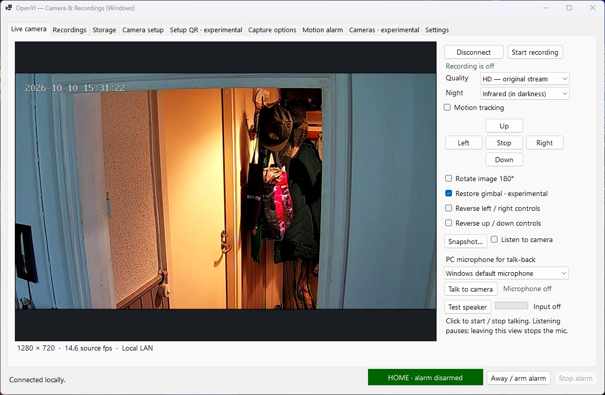

# OpenYI

An independent, open source LAN viewer and recorder for supported **YI IoT** cameras.
Keep your recordings on your own disk and use the camera's controls without a
vendor account login during normal operation.



Previously called YI Local. The repository remains **YI-Cam**. Existing profile,
recording, database, executable and launcher paths retain their original names
for compatibility, including existing Windows Firewall allowances. The verified
pre-enhancement version is tagged `baseline-yi-local-0.1`.

**Native C# / WinForms is the Windows application. Python remains the protocol
prototype and portable reference.** The Windows application does not run Python,
BlueStacks, or the vendor client in the background.

This is an early release, initially verified with one Anyka-family camera:
hardware **253**, firmware **6.0.24.10_202401091113**. Other cameras using the
same app name may use different hardware and protocols. Account-free fresh
provisioning and native 4K capture remain unverified.

## Windows application

1. Install the [.NET 10 SDK](https://dotnet.microsoft.com/download/dotnet/10.0).
2. Run **Build Windows.cmd**, then **Start Windows.cmd**.
3. Open the camera's live view in the already paired YI IoT PC app. In OpenYI's
   **Camera setup**, enter the camera's LAN address and click **Import from running
   YI IoT**. This verifies and saves the key, then connects. You can also import an
   existing `.dpapi` profile under the same Windows account or enter a known key.
4. Choose an [FFmpeg executable](https://ffmpeg.org/download.html) in **Storage**
   for live preview and 4K export. Original-stream recording itself is native C#
   and does not need FFmpeg. A sibling `ffmpeg.exe` is detected automatically.
5. Click **Connect camera**. If Windows requests network access, allow the app
   on the network containing your camera. The camera's discovery reply uses a
   different UDP source port, so an inbound LAN allowance can be necessary.

Build output: `dist/YI-Local/YiLocal.Windows.exe`. A standard build needs the
.NET 10 Desktop Runtime on the destination PC. To include the runtime:

```powershell
powershell -NoProfile -File scripts/build-windows.ps1 -SelfContained
```

App preferences live in `%LOCALAPPDATA%\YI Local\settings.json`, independently of
the executable's folder or working directory. Starting from `dist/` uses the same
settings. Storage and capture edits save automatically when recordings are stopped;
changes made during recording wait until it stops. Path edits save after leaving
the text box. Explicit Save buttons remain available. A previous valid version is
kept in `settings.json.bak`; invalid sections are reported without discarding other
settings. Camera keys, stream quality and arrow preferences stay in encrypted
per-camera profiles. Night vision, tracking and gimbal state are read from the camera.
Recording, listening and talking start manually each time. No registry setup is needed.

No camera firmware changes or Internet port forwarding are required. The app
makes no cloud requests and exposes no HTTP server. The camera firmware may still
contact vendor services; this app does not change the camera's network settings.
Router-level Internet blocking has not been tested.

**Cameras · experimental** adds independent camera configurations and a grid.
The primary camera keeps its existing pairing and recording paths. Additional
cameras have separate encrypted profiles, sessions, controls and catalogues, and
their recordings appear in the browser. Only one physical camera is available
for verification; two simulated cameras cover software isolation. See
[multi-camera setup and qualification limits](docs/MULTI_CAMERA.md).

## Controls

**Setup QR · experimental** can save a normal PNG for display on a phone. Fresh
setup currently requires an existing vendor binding token; a separate Wi-Fi-change
format requires the vendor display device ID. Images are generated entirely
locally, but neither flow has been physically verified. Account-free first-time
provisioning is not established. See [the QR findings](PROTOCOL.md#experimental-setup-qr).
Do not reset a working camera to test this feature.

| Control | Verified behavior on the test camera |
| --- | --- |
| HD | H.264, 1280 × 720; about 15.2 source frames/s in the measured stream |
| SD | H.264, 640 × 360 |
| Automatic quality | Camera-selected stream; dimensions may change |
| Pan/tilt | Short direction commands followed by stop; left/right physically checked |
| Motion tracking | Commands/readback verified; the owner also confirms local physical tracking works |
| Rotate image 180° | Camera readback and visibly rotated/restored live image verified |
| Restore gimbal | Off/on readback verified; reads the existing setting on connection; physical return behavior remains experimental |
| Reverse left/right or up/down controls | Per-camera local arrow preferences; do not disable motor axes |
| Infrared | IR activates automatically in darkness; red LEDs and filter click physically confirmed |
| Colour night vision | Extra visible lights activate; physically confirmed |
| Automatic lighting | Mode accepted and read back; trigger behavior not yet characterized |
| Talk to camera | 16 kHz mono AAC speaker playback physically confirmed; click to start/stop the PC microphone |

Forced IR in a bright room is not established. The generic day/night command
accepted values but had no observed physical effect on this model; the app uses
the separate light-mode command that worked.

**Export 4K (upscaled)** creates a 3840 × 2160 software upscale. It does not add
sensor detail or establish native 4K support. Default recording preserves the
original camera stream without re-encoding; optional profiles are described below.
Measured frame rates are observations of this
stream, not a claimed hardware maximum.

## Local recording and storage

The **Capture options** tab keeps **Original stream** as the default: native,
lossless remuxing with the camera's original frames and timing. Optional FFmpeg
H.264 profiles use CRF 28 (balanced) or CRF 32 (smaller). With either encoding
profile, select a recording rate from 0.5 to 120 fps, capped by available source
pictures, or leave it at source rate. Presets include 5, 1 and 0.5 fps. These
settings do not reduce the live preview rate. Re-encoding uses CPU and loses some
detail; a remux alone does not substantially shrink the encoded stream.

**Continuous / low-rate** preserves real elapsed time. **Timelapse** plays selected
pictures at 25 fps and deliberately shortens playback. The final low-rate picture
is held for one selected interval, so playback can extend by up to that interval
beyond the last captured picture. Capture duration is stored separately and is
used for storage estimates. Optional **Include camera microphone audio** retains
AAC with its camera timestamps in real-time profiles. Timelapse has no audio.
**Listen to camera** enables local speaker monitoring using FFmpeg and Windows
audio output. Both options start off; see [audio evidence and limits](docs/AUDIO.md).

**Talk to camera** sends the selected PC microphone to the primary camera over the
LAN using FFmpeg's AAC encoder. Click again, press Escape, switch tabs or switch
away from OpenYI to stop. Listening pauses while talking to limit feedback; this is
half-duplex intercom behavior. The microphone is released when talking stops and
does not restart automatically. See [talk-back protocol and limits](docs/AUDIO.md#talk-to-camera).

**Motion · local detection on this PC** records when the source image changes.
Set the changed-area threshold (lower is more sensitive) and the seconds to record
after the last motion; each new movement restarts that timer. It works with
original-stream and reduced-rate profiles without reducing live preview fps.
A bounded GOP buffer includes a short lead-in when available. FFmpeg is required
for detection, and OpenYI must remain open and connected. Camera movement and
lighting can also trigger it. See [motion behavior and verification](docs/MOTION.md).

**Save snapshot** saves a full source-resolution PNG from the current decoded
camera GOP, rather than the scaled preview. It requires FFmpeg. Snapshots are
explicit exports to a chosen file and are outside automatic recording recycling.

The capture tab estimates MB/hour and GB/day from recent completed recordings
with the saved profile. Scene detail, noise, motion and keyframes affect the
result; lower frame rate alone does not guarantee a smaller output. Measured
examples and their limits are in [recording measurements](docs/RECORDING.md).

- Default location: your **Videos / YI Local** folder, outside the source repository.
- Fragmented MP4 with optional AAC audio, using camera timestamps for playback timing.
- Default policy: 10-minute clips, 20 GiB recording budget, 2 GiB of free disk space.
  Clip rotation waits for a keyframe, so the target length is approximate.
- Recycling starts **off**. Recording stops when a configured space limit is reached.
- With recycling enabled, the oldest completed, unprotected app-managed clips are
  deleted when needed. An optional maximum age can also trigger recycling.
- Only files registered in the folder's SQLite catalogue are managed. Unrelated
  videos, exports, active clips, and protected clips are excluded from recycling.
- The **Recordings** tab has thumbnails, metadata, date/time, camera, protection
  and recording-type filters, plus embedded playback with pause and seeking.
  Protect, export and delete operate on the same catalogue. Active playback and
  export reserve their clips against recycling without changing protection.
  See [browser/player details](docs/BROWSER.md).
- One recorder may write to a library at a time. Python and C# share its catalogue
  format. Use separate folders for simultaneous independent sessions.
- Windows is kept awake during recording. Closing the app finishes the current
  clip. Connection loss finishes a clip and retries; an armed recording resumes
  after a new keyframe. A rejected device key stops retries and opens Camera setup
  so its saved pairing can be refreshed.

The C# muxer writes one fragment per picture; Python uses keyframe fragments.
Completed fragments can remain readable after a crash, but the last fragment may
be lost. Interrupted entries remain marked incomplete and are not automatically
recycled. Recovery/catalogue repair and long-duration unattended soak testing
remain future work. The muxer currently targets the verified H.264 stream without
B frames; other codec/reordering formats need explicit support.

## Pairing

The camera requires a **device pairing key**, not the user's account password.
Normal operation uses that saved key to authenticate directly to the LAN camera.
The camera identity is pinned after an authenticated connection. Account pairing
and the current device key are separate: an existing vendor pairing can remain
valid while the key saved by this app becomes outdated.

**If the camera rejects the device key:** open its live view in the vendor PC app,
then use **Camera setup → Import from running YI IoT** in the Windows app. There is
no need to reset the camera or repeat QR pairing. The native importer requires
the verified 32-bit YI IoT PC client `1.0.1.1_202209261648`, running under the same
Windows account. It checks the executable's SHA-256, reads the matching live
camera's pairing with read-only process access, and authenticates directly to
that camera before saving. It needs neither Python nor Frida and does not inject
code or change the vendor process. Close the vendor app after a successful import.

Imported profiles and manually entered keys are verified before replacing an
existing profile. Failed or canceled imports preserve it. Import finishes an
active recording; after success, an armed recorder resumes in a new clip.

A different key was observed after the test camera was power-cycled and moved;
the vendor client reconnected using its existing pairing. The mechanism that
refreshes this key has not yet been established. Independent, automatic key
refresh is **not implemented**; when a saved key stops working, this recovery
currently depends on a working vendor live view or another valid device key.
This does not establish that every power cycle changes the key.

WinForms saves the profile using current-user Windows DPAPI under
`%LOCALAPPDATA%\YI Local\device.dpapi`. The Python prototype uses
`.local/device.dpapi` on Windows; a source-tree native build can import that profile
automatically on first launch. DPAPI files are tied to the Windows account and
are not portable plain-text exports. Keys are never printed in application logs.

The Python prototype can optionally import a key from an already paired,
running YI IOT PC live view:

```powershell
.venv\Scripts\python.exe -m pip install -r requirements-import.txt
```

Use **Camera setup → Import** in the Python app. The importer checks the executable
SHA-256 and only supports the tested 32-bit client `1.0.1.1_202209261648`. It reads
the existing local pairing and does not modify the installed vendor executable.
The Python and Windows applications keep separate profiles; refresh each one
when needed, or import the updated encrypted file. Importing again with an existing
saved profile is supported. The candidate key
must authenticate before the saved profile is replaced; failed imports preserve
it. Restart the Python app after updating its source so it loads the current importer.

**Preserve an existing pairing.** Fresh QR generation is experimental; completing
account-free provisioning has not been established. The observed
vendor QR includes Wi-Fi information and a server-issued binding token; an
independent provisioning flow has not been established. Do not reset a working
camera merely to try this app.

## Python reference

Python 3.12+ with Tcl/Tk is needed for the prototype UI. On Windows, run **Setup.cmd**,
then **Start Recorder.cmd**. Its launcher hides the console of `python.exe`.

For Linux/macOS, use a virtual environment and install
`requirements-crossplatform.txt`, then run `python -m yicam.app`. Keys use the OS
keychain (Secret Service on Linux, Keychain on macOS), without a plain-text fallback.
Enter a known device key; Windows DPAPI profiles and the optional PC-client importer
are Windows-specific. Live hardware testing so far has been on Windows; Linux/macOS
desktop integration remains unverified.

```powershell
.venv\Scripts\python.exe -m yicam.cli status
.venv\Scripts\python.exe -m yicam.cli record --seconds 60 --quality hd
.venv\Scripts\python.exe -m yicam.cli night infrared
.venv\Scripts\python.exe -m yicam.cli tracking on
.venv\Scripts\python.exe -m yicam.cli move left
```

## Source layout and checks

| Path | Purpose |
| --- | --- |
| `src/YiLocal.Core` | Native LAN protocol, verified pairing import, frame ordering, MP4 muxer, storage catalogue |
| `src/YiLocal.Windows` | WinForms UI, preview and export adapters |
| `yicam` | Python protocol prototype, GUI and CLI |
| `tests/YiLocal.Checks` | Native pairing, protocol, timing, storage and optional hardware checks |
| `tests/test_*.py` | Python transport and retention tests |
| `scripts/check_media_integration.py` | Synthetic native muxing and independent PyAV decode test |
| [PROTOCOL.md](PROTOCOL.md) | Observed wire formats, command IDs and uncertainty |

```powershell
dotnet build YiLocal.sln
dotnet run --project tests/YiLocal.Checks
python -m unittest discover -s tests -v
```

The synthetic media integration check additionally needs `imageio-ffmpeg==0.6.0`.
It generates a test pattern; no camera or personal video is used. GitHub Actions
is configured for Windows and Linux source checks. See [CONTRIBUTING.md](CONTRIBUTING.md).

MIT licensed original source; dependencies retain their own licenses. See
[THIRD-PARTY.md](THIRD-PARTY.md), including the separate FFmpeg binary packaging notes.
This project is independent and is not affiliated with YI or the camera vendor.

Private research, camera captures, keys, recordings, vendor files and compiled
binaries are excluded from Git. Create public source packages using **git archive**,
not by zipping an entire development checkout containing ignored files.
